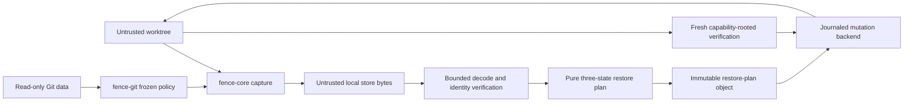
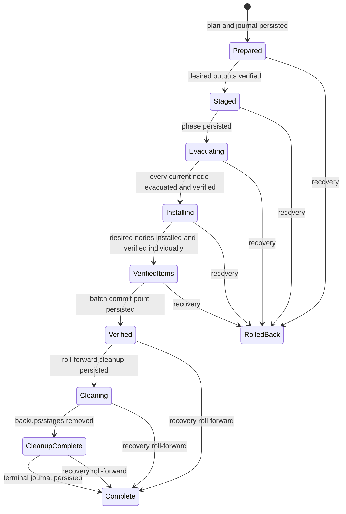

# Independent safety review guide

This document is the shortest path through Fence for a Rust/filesystem
reviewer. Fence is pre-release software that mutates worktrees only after a
state-based proof. Review findings should distinguish loss of modeled state
from metadata that Fence explicitly excludes and refuses where observable.

## Trust boundaries



The primary implementation boundaries are:

| Boundary | Code | Reviewer question |
|---|---|---|
| Native paths | `fence-core/src/path.rs` | Can stored bytes escape the worktree or change encoding family? |
| Private store | `fence-core/src/store_fs.rs`, `object.rs` | Can any store component, record publication, lock, tombstone or GC operation escape the retained directory capability? |
| Object identity | `fence-core/src/object.rs` | Are declared length, decompression output and BLAKE3 identity all bounded and checked? |
| Manifest schema | `fence-core/src/manifest.rs` | Can corrupt CBOR create duplicate paths, prefix collisions or invalid platform metadata? |
| Capture | `fence-core/src/capture.rs`, `capture_windows.rs` | Is every included node opened without following an attacker-controlled link and checked for stability? |
| Frozen scope | `fence-git/src/policy.rs` | Are identical policy bytes and boundaries used at every endpoint? |
| Pure inverse | `fence-core/src/restore.rs`, `merge.rs` | Can a third current state ever become an overwrite or deletion? |
| Plan binding | `fence-session/src/restore_plan.rs` | Is every journaled transformation independently derivable from retained snapshots? |
| Mutation/recovery | `fence-session/src/restore/mod.rs`, `restore/journal.rs`, `restore/windows.rs` | Is every rename no-clobber, verified, and recoverable at each persisted state? |
| Index | `fence-session/src/restore/mod.rs` | Does index drift always refuse before replacement? |
| Store maintenance | `fence-session/src/maintenance.rs` | Can corrupt reachability metadata cause collection of a retained object? |

`fence-git` must remain read-only. Search for all write-capable Git APIs when
reviewing dependency or feature changes. Runtime code must not spawn `git`.

## Mutation state machine



Before `Verified`, recovery reconstructs the exact captured current state in
reverse item order. At and after `Verified`, recovery never attempts rollback;
it re-verifies desired nodes and finishes cleanup. `NeedsRecovery` is
pre-commit. A missing, changed or ambiguous live/stage/backup node retains the
journal and returns an error.

This is process-crash recovery, not a filesystem-wide atomic transaction and
not a machine-power-loss guarantee. See [Safety and threat
model](safety.md).

## Invariants and executable evidence

| Invariant | Primary implementation | Primary tests |
|---|---|---|
| Pre-session modeled state is not destroyed | `RestorePlan::calculate` | `fence-core/tests/restore_matrix.rs`; `restore::tests::pre_session_state_is_never_rewritten` |
| Post-session modeled state is not silently destroyed | exact current capture and structured conflicts | `opaque_third_content_never_produces_a_content_write`; `refuses_to_overwrite_post_session_bytes` |
| Capture does not mutate Git/worktree | read-only `GitContext`, capability traversal | session endpoint tests; repository-state comparisons |
| Degraded capture cannot restore | `RestorePlan::calculate` completeness gate | core restore degraded-input tests |
| Ambiguity is visible | `ConflictReason`, `RestoreApplyResult`, whole-batch conflict gate | restore matrix; merge overlap tests |
| Raw bytes, not Git-normalized bytes | object store over opened file bytes | object round trips; non-UTF-8 path fixture |
| Stored paths are untrusted | component validation and protected mutation paths | path tests; `restore_refuses_git_metadata_before_selected_capture` |
| Journal transformations are untrusted | immutable restore plan and recalculation | `plan_bound_recovery_refuses_a_journal_authored_transformation` |
| Process death is recoverable | batch journal state machine | `subprocess_crash_recovery_matrix` |
| Index drift is preserved | raw exact equality under `index.lock` | `restores_raw_index_only_after_exact_endpoint_match`; `index_is_rechecked_after_its_lock_is_acquired` |
| GC never guesses reachability | verify all retained records before sweep | maintenance GC tests |

Run exact safety suites with:

```console
cargo test -p fence-core --test restore_matrix
cargo test -p fence-core restore::
cargo test -p fence-session restore::tests:: -- --test-threads=1
cargo test -p fence-session maintenance::
```

The subprocess crash test uses three processes: the parent creates synthetic
expected state, a restore helper is killed externally, and an independent
recovery helper rediscovers Git and reopens the store before recovery. Do not
run either ignored helper directly.

The isolated fuzz workspace exercises manifest/native-path/session/policy/plan/
journal/object-envelope parsing plus pure restore-plan calculation and unified
diff rendering:

```console
cargo check --manifest-path fuzz/Cargo.toml --bins
cargo fuzz run journal_decode -- -max_total_time=30
```

## Known mutation refusals

The Unix alpha intentionally refuses:

- sessions without a complete frozen policy;
- degraded manifests;
- repository-state drift or a repository operation transition;
- protected `.git`, Fence-store, submodule and nested-repository paths;
- regular files with multiple hard links;
- regular files or empty directories with detected unmodeled ACL/xattr data;
- regular files or empty directories whose metadata query was unavailable;
- schema-v1/v2 regular/directory entries whose metadata absence was not proven;
- split indexes, sparse checkout and sparse indexes;
- current index bytes different from the recorded session endpoint;
- binary or opaque third content;
- overlapping, invalid-UTF-8, NUL-containing or oversized text merges;
- missing parent reconstruction and ancestor/type collisions;
- unresolved or legacy-unbound restore journals.

Symlink guarantees cover path presence/type and opaque target bytes only.
Ownership, timestamps, general Unix mode bits, symlink metadata, filesystem
flags and resource forks are outside the modeled state. Do not broaden the
guarantee without a schema, capture, pre-mutation verification, restoration and
cross-platform test change in the same reviewed series.

Windows capture/review is experimental. The current metadata observation is
`Unavailable`, so the project makes no Windows worktree-mutation claim.

## Review checklist

For any mutation change, require evidence for all applicable items:

- the pure planner result is deterministic and has a named matrix row;
- every target path is validated before any ambient or capability-rooted open;
- current identity is checked immediately before evacuation;
- stage and backup nodes are byte/type/mode verified;
- publication and evacuation cannot replace an existing name;
- a new durable state has defined pre/post-commit recovery behavior;
- every journal field is bounded and treated as untrusted;
- process-death tests kill after the new durable transition;
- post-session creator/replacement races remain visible conflicts;
- GC refuses unresolved new journal states;
- public JSON, diagnostics and safety documentation describe refusals honestly;
- Linux and macOS tests pass; Windows code compiles without gaining a mutation claim.

The `fence-unix` crate is the only Unix native-FFI boundary. Its macOS ACL
query operates on the same open descriptor used for content and identity
verification; reviewers should reject a replacement that falls back to a
worktree path lookup.

## Reporting findings

Data-loss, containment, integrity and recovery findings should follow
[SECURITY.md](../SECURITY.md). A useful synthetic report includes:

- Fence revision and platform/filesystem;
- `fence doctor --format json`;
- the session ID and journal state, but no proprietary object bytes;
- the minimal base/session/current node states;
- whether a direct process crash or machine-power loss occurred;
- names and hashes of retained stage/backup nodes, if safe to disclose.
